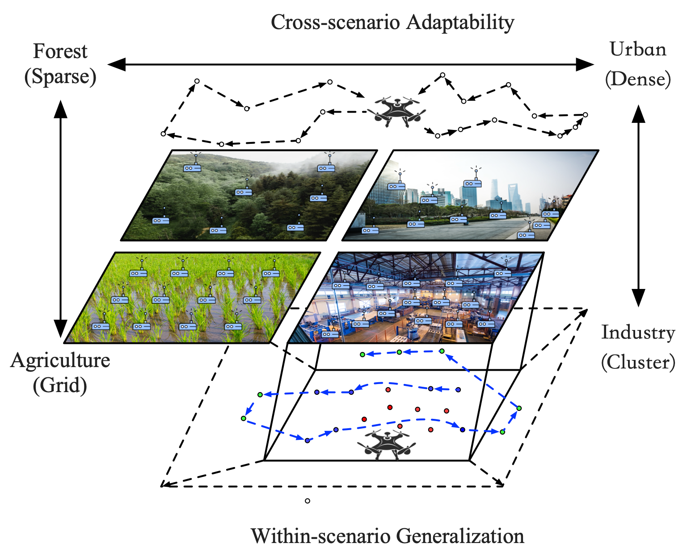
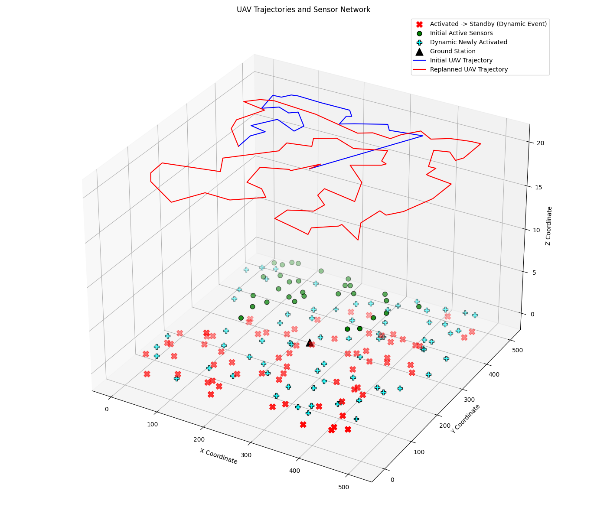

# ADAPT-GUAV: Scalable and Generalizable UAV Trajectory Design for Dynamic IoT Environments

This repository contains the official implementation for the paper **ADAPT-GUAV: Scalable and Generalizable UAV Trajectory Design for Dynamic IoT Environments**.


*The two dimensions of the Trajectory Generalization Problem: Cross-scenario Adaptability and Within-scenario Generalization.*


*Visualization of a UAV trajectory planned by our model in a dynamic simulation environment.*

---

## Table of Contents

1. [Introduction](#introduction)
2. [Repository Structure](#repository-structure)
3. [Requirements &amp; Installation](#requirements--installation)
4. [Dataset](#dataset)
5. [Usage](#usage)
   - [Training a New Model](#training-a-new-model)
   - [Reproducing Simulation Experiments](#reproducing-simulation-experiments)
6. [Citation](#citation)
7. [Acknowledgements](#acknowledgements)

---

## Introduction

Designing efficient Unmanned Aerial Vehicles (UAV) trajectories that generalize across the diverse spatial patterns of dynamic Internet of Things (IoT) environments is a critical challenge. Conventional learning-based solutions often fail to adapt without costly online retraining, limiting their practicality in resource-constrained applications. This paper introduces `ADAPT-GUAV`, a framework that resolves this limitation by separating intensive offline training from lightweight online inference. The framework features a novel hardness-adaptive curriculum, where a topology-driven generator synthesizes a diverse spectrum of problem instances, from sparse to clustered. This process allows the policy to learn robust, universal heuristics offline, enabling an online module to instantly generate near-optimal trajectories for unseen and dynamic networks without retraining. Evaluations confirm that `ADAPT-GUAV` matches the solution quality of state-of-the-art heuristics while reducing online computation time by over two orders of magnitude. The framework demonstrates robust generalization across diverse single-UAV scenarios and scales effectively to multi-UAV coordination tasks, showcasing an emergent capability to balance energy efficiency with workload distribution.

---

## Repository Structure

The repository is organized as follows:

```
.
├── ADAPT_GUAV/
│   ├── nets/               # Core neural network models (Attention, Pointer, Critic)
│   ├── problems/           # Definitions for VRPs (TSP, MTSP, etc.)
│   ├── pretrained_models/  # Pre-trained model weights
│   ├── src/                # Scripts for training models
│   ├── data/               # Training and validation datasets (.pkl)
│   └── utils/              # Utility functions, options, and loggers
├── experiments/
│   ├── Simulating_a_data_collection_scenario/ # Core simulation logic
│   │   ├── main.py         # Run simulation with LKH baseline
│   │   ├── main_pretrained.py # Run simulation with our pre-trained model
│   │   └── ...             # Other simulation and plotting scripts
│   └── data/               # Experimental results and analysis scripts
└── README.md
```

---

## Requirements & Installation

### 1. Python Dependencies

We recommend creating a virtual environment to manage dependencies.

```bash
python -m venv venv
source venv/bin/activate  # On Windows use `venv\Scripts\activate`
```

The main Python dependencies are listed below. You can install them using pip. For a smoother installation, we recommend creating a `requirements.txt` file.

* **PyTorch**: The core deep learning framework.
* **NumPy**: For numerical operations.
* **tqdm**: For progress bars.
* **Matplotlib**: For plotting results.
* **Pandas**: For data handling.
* **gradysim**: The simulation framework.

**Suggestion:** Create a `requirements.txt` file with the following content and install using `pip install -r requirements.txt`.

```
torch
numpy
tqdm
matplotlib
pandas
gradysim
scipy
```

### 2. External Solvers

For running baseline comparisons, this project utilizes several external solvers.

* **Concorde (for TSP)**:
  You can use the provided script to install it.

  ```bash
  cd ADAPT_GUAV/problems/tsp/
  bash install_concorde.sh
  cd ../../..
  ```
* **LKH-3 (for TSP)**:
  An executable `LKH-3.exe` is provided in the `experiments/Simulating_a_data_collection_scenario/` directory. You may need to compile it from the source for your specific OS from the `LKH-3.0.13` subdirectory.
* **Gurobi (Optional)**:
  If you have a Gurobi license, you can use it for solving certain problems. Ensure your `gurobipy` library is installed and accessible.

---

## Dataset

The datasets used for training and validation are located in `ADAPT_GUAV/data/`. They are provided as `.pkl` files.

* **Training data**: e.g., `tsp50_train_seed1111_size10K.pkl`
* **Validation data**: e.g., `tsp50_val_mg_seed2222_size10K.pkl`

These datasets can be generated using the `ADAPT_GUAV/utils/src/generate_data.py` script.

---

## Usage

### Training a New Model

You can train a new model from scratch or fine-tune an existing one using the scripts in `ADAPT_GUAV/src/`. For example, to train a model for TSP with 200 nodes:

```bash
python ADAPT_GUAV/src/train_tsp200_unified.py --graph_size 200 --n_epochs 100 --baseline rollout --run_name tsp200_train_example
```

All training options can be found in `ADAPT_GUAV/utils/src/options.py`.

### Reproducing Simulation Experiments

The core dynamic simulation experiments are located in `experiments/Simulating_a_data_collection_scenario/`.

#### 1. Running the Baseline (LKH Solver)

To run the simulation using the traditional LKH solver as the UAV's path planning algorithm:

```bash
python experiments/Simulating_a_data_collection_scenario/main.py
```

This will generate `simulation_results.csv` with the performance metrics for the LKH baseline.

#### 2. Running with Our Pre-trained Model (ADAPT-GUAV)

To run the simulation using our pre-trained attention model:

```bash
python experiments/Simulating_a_data_collection_scenario/main_pretrained.py
```

This script will load the model specified inside it (e.g., `tsp200_attention_custom_final.pt`) and use it for dynamic replanning. The results will be saved to `simulation_results_pretrained.csv`.

**Note:** The model path inside `main_pretrained.py` might be hardcoded. Please ensure it points to a valid model in the `ADAPT_GUAV/pretrained_models/` directory. For example, you might need to change line 238 to:
`model_path = "ADAPT_GUAV/pretrained_models/tsp200_attention_custom_final.pt"`

A complete package of all pre-trained models used in our experiments is available for download from Google Drive: [Pre-trained Models](https://drive.google.com/file/d/1YBbqW6u1WQqHztmODofVyy9eYwyQGrXV/view?usp=sharing). Please download and extract the contents into the `ADAPT_GUAV/pretrained_models/` directory.
#### 3. Visualizing Results

After running the simulations, you can use the provided plotting scripts to visualize the UAV trajectories and analyze the results. For example:

```bash
python experiments/Simulating_a_data_collection_scenario/plot_trajectories.py
```

---

---

## Simulation Framework

The dynamic data collection process is simulated using the [gradysim](https://project-gradys.github.io/gradys-sim-nextgen/) framework. The core logic for the simulation is located in the [`experiments/Simulating_a_data_collection_scenario/`](experiments/Simulating_a_data_collection_scenario/) directory. This framework allows for detailed modeling of UAV mobility, wireless communication, and event-driven interactions between network entities.

The simulation is orchestrated by three main components:

1.  **[`main.py`](experiments/Simulating_a_data_collection_scenario/main.py)**: This script serves as the entry point for launching the simulation. It is responsible for:
    *   Setting up the simulation environment and its parameters.
    *   Loading IoT device locations from pre-generated TSP instance files (e.g., `.pkl` files).
    *   Instantiating the nodes: a single UAV, a ground station, and multiple IoT sensors.
    *   Assigning the corresponding protocols to each node.
    *   Running the simulation and collecting key performance metrics upon completion, such as mission duration, path length, energy consumption, and data collection latency.

2.  **[`simple_protocol.py`](experiments/Simulating_a_data_collection_scenario/simple_protocol.py)**: This file contains the core behavioral logic for all simulated entities, defining how they interact within the environment.
    *   **`SimpleUAVProtocol`**: Implements the decision-making logic for the UAV. It plans its trajectory to service active sensors, using either the traditional LKH-3 solver or our pre-trained Attention-based model for path optimization. It manages its flight, communicates with sensors to collect data, and offloads the collected data to the ground station.
    *   **`SimpleSensorProtocol`**: Defines the behavior of individual IoT devices. Sensors transition between states (e.g., `RAW`, `STANDBY`, `ACTIVE`, `SERVICED`). When active, a sensor generates data packets and broadcasts service requests until visited by the UAV.
    *   **`SimpleGroundStationProtocol`**: Models the base station, which acts as the final destination for all collected data. It receives data batches from the UAV and logs them to calculate overall system performance.

3.  **[`visualize_routes.py`](experiments/Simulating_a_data_collection_scenario/visualize_routes.py)**: A utility script for visualizing the simulation results. It reads the trajectory data saved during a simulation run and generates plots of the UAV's flight path, providing a clear visual representation of the route taken to service the sensors.

## Acknowledgements

This work relies on several excellent open-source projects, including [PyTorch](https://pytorch.org/), [gradysim](https://project-gradys.github.io/gradys-sim-nextgen/), and the original [attention-learns-to-route](https://github.com/wouterkool/attention-learn-to-route), [TSP-HAC](https://github.com/wondergo2017/TSP-HAC) repository.
